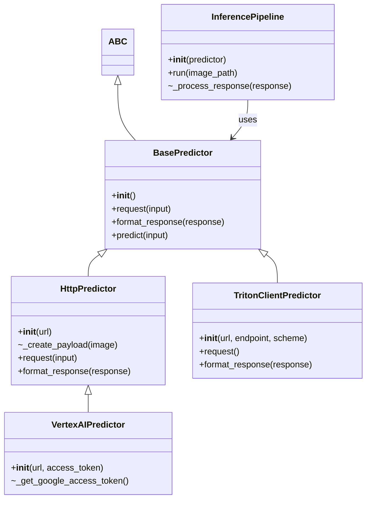
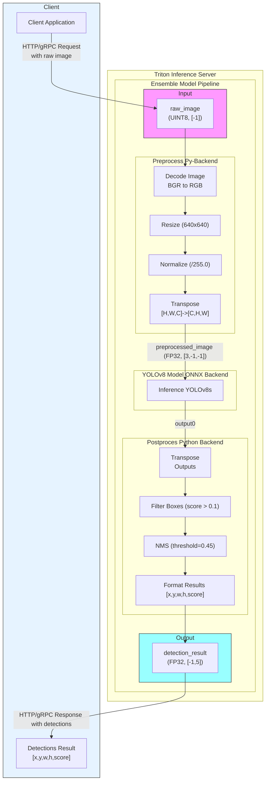

# Object Detection with Triton Inference Server

<table>
  <tr>
    <td>
      <a href="#"></a>
    </td>
    <td>
      <a href="#"></a>
    </td>
    <td>
      <a href="#"></a>
    </td>
    <td>
      <a href="#"></a>
    </td>
    <td>
      <a href="#"></a>
    </td>
  </tr>
</table>

This project provides a  pipeline for deploying and performing inference with a YOLOv8 object detection model using [Triton Inference Server](https://github.com/triton-inference-server/server) on Google Cloud's Vertex AI, locally or Docker based systems. The repository includes scripts for automating the deployment process, a graphical user interface for inference, and performance analysis tools for optimizing the model's performance.

## Table of Contents

- [Project Structure](#-project-structure)
- [Features](#%EF%B8%8F-features)
- [Dependencies](#-dependencies)
- [Installation](#installation)
- [Inference](#inference)
- [Ensemble Model](#ensemble-model)
- [Notes](#-notes)
- [License](#-license)


## 📁 Project Structure

### Key Files
- **`requirements.txt`**: Lists the external libraries and dependencies required for the project.
- **`server/`**: Contains scripts for deploying the model to Triton Inference Server.
  - **`local/`**: Scripts for running the Triton Inference Server locally.
  - **`vertexai/`**: Scripts for deploying the model to Vertex AI Endpoint.
  - **`...`**: Scripts for uploading/download the model to/from Google Cloud Storage and exporting the model to ONNX format.
- **`signature-detection/`**: Contains scripts for performing inference with the YOLOv8 model.
   - **`analyzer/`**: Contains results and configuration for performance analysis using Triton Model Analyzer.
   - **`inference/`**: Scripts for performing inference using Triton Client, Vertex AI, or locally and GUI for visualization.
      - **`inference_gui.py`**: Script for running the Gradio interface for inference.
      - **`inference_pipeline.py`**: Script for performing inference on images using different methods.
      - **`predictors.py`**: Contains the predictor classes for different inference methods. You can add new predictors for custom inference methods.
   - **`models/`**: Contains the Model Repository for Triton Server, including the YOLOv8 model and pre/post-processing scripts in a Ensemble Model.
- **`Dockerfile`**: Contains the configuration for building the Docker image for Triton Inference Server. 

## 🛠️ Features

- **Seamless Model Deployment**: Automates the deployment of the YOLOv8 model using Triton Inference Server.
- **Multi-Backend Support**: Allows inference locally, on Vertex AI, or directly with Triton Client.
- **Optimized Performance**: Utilizes Triton's features like dynamic batching, OpenVINO backend and Ensemble Model for efficient inference.
- **GUI for Easy Inference**: Provides an intuitive Gradio interface for interacting with the deployed model.
- **Automated Scripts**: Includes scripts for model uploading, server startup, and resource cleanup.

## 📦 Dependencies

To get started, ensure you have the following installed:

- **Docker**: For building the Docker image for Triton Inference Server.
- **Python Packages**: Installable via:
  ```bash
  pip install -r requirements.txt
  ```
- **Google Cloud SDK**: Required for interacting with Google Cloud Storage and (Optional) Vertex AI.
- **Prometheus** (Optional): For monitoring the performance of the Triton Inference Server.

## Installation 

1. **Clone the repository**:
   ```bash
   git clone https://github.com/your-username/t4ai-triton-server.git
   ```
2. **Install dependencies**:
   ```bash
   pip install -r requirements.txt
   ```
3. **Configure your environment**: Set up Google Cloud credentials and project ID.
4. **Build and deploy**: 
   - **Vertex AI:** Follow the instructions in [`deploy_vertex_ai.sh`](server/vertexai/deploy_vertex_ai.sh) to deploy the model to Vertex AI Endpoint. Or programmatically using [`nvidia_triton_custom_container_prediction.ipynb`](server/vertexai/nvidia_triton_custom_container_prediction.ipynb).
   - **Local:** Run the Triton Inference Server locally using the provided Dockerfile. The [`serve_triton_local_.py`](server/local/serve_triton_local.py) script can be used to start the server.
   - **Docker:** Build the Docker image using the provided Dockerfile and run the container in your preferred environment.
5. **Run inference**: The scripts in signature-detection/inference can be used to perform inference on images using differents methods (requests, triton client, vertex ai).
   - **GUI:** Use the [`inference_gui.py`](signature-detection/inference/inference_gui.py) to test the deployed model and visualize the results.
   - **CLI:** Use the [`inference_pipeline.py`](signature-detection/inference/inference_pipeline.py) script to perform inference on images.

## Inference 

The [`inference_pipeline.py`](signature-detection/inference/inference_pipeline.py) script can be used to perform inference on images using different methods. The script supports the following methods:

- **Triton Client**: Inference using the Triton Inference Server SDK.
- **Vertex AI**: Inference using Google Cloud's Vertex AI Enpoint.
- **Http**: Inference using HTTP requests to the Triton Inference Server.



## Ensemble Model

The repository includes an [Ensemble Model](https://docs.nvidia.com/deeplearning/triton-inference-server/user-guide/docs/user_guide/architecture.html#ensemble-models) for the YOLOv8 object detection model. The Ensemble Model combines the YOLOv8 model with pre and post-processing scripts to perform inference on images. The model repository is located in the [`models/`](signature-detection/models) directory.



## 📊 Model Analyzer

The Triton Model Analyzer can be used to profile the model and generate performance reports. The [`metrics-model-inference.csv`](signature-detection/analyzer/profile_results/results/metrics-model-inference.csv) file contains performance metrics for various configurations of the YOLOv8 model.

You can run the Model Analyzer using the following command:
```bash
docker run -it  \
    -v /var/run/docker.sock:/var/run/docker.sock \
    -v $(pwd)/signature-detection/models:/signature-detection/models \
    --net=host nvcr.io/nvidia/tritonserver:24.11-py3-sdk 
```

```bash
model-analyzer profile -f perf.yaml \
    --triton-launch-mode=remote --triton-http-endpoint=localhost:8000  \
    --output-model-repository-path /signature-detection/analyzer/configs  \
    --export-path profile_results --override-output-model-repository \
    --collect-cpu-metrics --monitoring-interval=5
```

```bash
model-analyzer report --report-model-configs yolov8s_config_0,yolov8s_config_12,yolov8s_config_4,yolov8s_config_8 ... --export-path /workspace --config-file perf.yaml 
```

You can modify the [`perf.yaml`](signature-detection/analyzer/config/perf.yaml) file to experiment with different configurations and analyze the performance of the model in your deployment environment. See the [Triton Model Analyzer documentation](https://github.com/triton-inference-server/model_analyzer) for more details.

## 📝 Notes

- The repository includes various scripts for automation, such as [`upload_models_to_gcs.py`](server/upload_models_to_gcs.py), [`download_from_gcs.py`](server/download_from_gcs.py),[`export_onnx_model.py`](server/export_onnx_model.py), and deployment scripts.
- Performance tuning can be done using the `perf.yaml` file and related scripts to analyze and optimize the model's performance.
- Contributions are welcome! Feel free to open issues and pull requests.

## 📄 License

This project is licensed under the Apache License 2.0. See `LICENSE` for more details.

