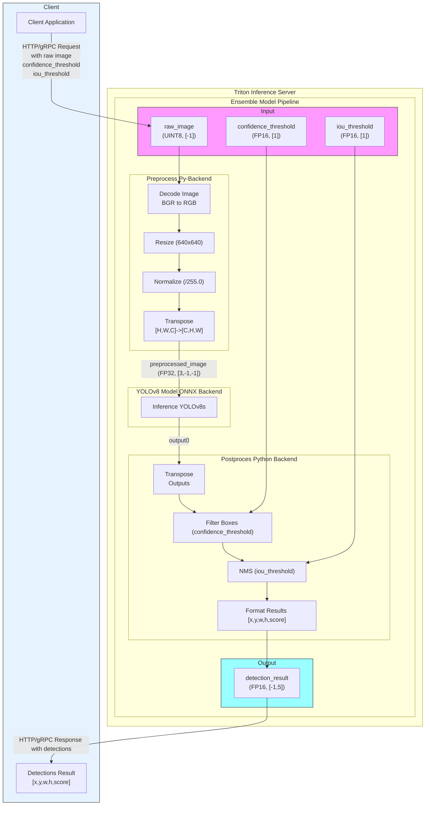
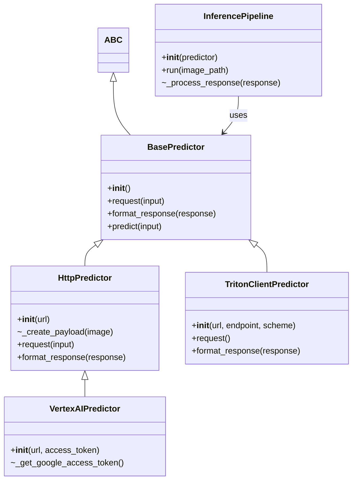

# Object Detection with Triton Inference Server

<table>
  <tr>
    <td>
      <a href="https://github.com/triton-inference-server/server"></a>
    </td>
    <td>
      <a href="https://www.docker.com/"></a>
    </td>
    <td>
      <a href="https://www.python.org/"></a>
    </td>
    <td>
      <a href="https://www.apache.org/licenses/LICENSE-2.0.html"></a>
    </td>
    <td>
      <a href="https://opencv.org/"></a>
    </td>
  </tr>
</table>

This project provides a  pipeline for deploying and performing inference with a YOLOv8 object detection model using [Triton Inference Server](https://github.com/triton-inference-server/server) on Google Cloud's Vertex AI, locally or Docker based systems. The repository includes scripts for automating the deployment process, a graphical user interface for inference, and performance analysis tools for optimizing the model's performance.

## Table of Contents

- [Project Structure](#-project-structure)
- [Features](#%EF%B8%8F-features)
- [Installation](#installation)
- [Ensemble Model](#ensemble-model)
- [Inference](#inference)
- [Limit Endpoint Access](#limit-endpoint-access)
- [Model Analyzer](#-model-analyzer)
- [Model & Dataset Resources](#-model--dataset-resources)
- [Notes](#-notes)
- [License](#-license)


## 📁 Project Structure

### Key Files
- **[`requirements.txt`](requirements.txt)**: Lists the external libraries and dependencies required for the project.
- **[`server/`](./server/)**: Contains scripts for deploying the model to Triton Inference Server.
  - **[`local/`](./server/local/)**: Scripts for running the Triton Inference Server locally.
  - **[`vertexai/`](./server/vertexai/)**: Scripts for deploying the model to Vertex AI Endpoint.
- **[`signature-detection/`](./signature-detection/)**: Contains scripts for performing inference with the YOLOv8 model.
   - **[`analyzer/`](./signature-detection/analyzer/)**: Contains results and configuration for performance analysis using Triton Model Analyzer.
   - **[`inference/`](./signature-detection/inference/)**: Scripts for performing inference using Triton Client, Vertex AI, or locally and GUI for visualization.
      - **[`inference_onnx.py`](./signature-detection/inference/inference_onnx.py)**: Script for performing inference with ONNX runtime locally.
      - **[`inference_pipeline.py`](./signature-detection/inference/inference_pipeline.py)**: Script for performing inference on images using different methods.
      - **[`predictors.py`](./signature-detection/inference/predictors.py)**: Contains the predictor classes for different inference methods. You can add new predictors for custom inference methods.
  - **[`gui/`](./signature-detection/gui/)**: Contains the Gradio interface for interacting with the deployed model. The [`inference_gui.py`](./signature-detection/gui/inference_gui.py) script can be used to test the model in real time. The UI has built-in examples and plots of results and performance.
   - **[`models/`](./signature-detection/models/)**: Contains the Model Repository for Triton Server, including the YOLOv8 model and pre/post-processing scripts in a Ensemble Model.
   - **[`data/`](./signature-detection/data/)**: Contains the datasets and data processing scripts.
   - **[`utils/`](./signature-detection/utils/)**: Scripts for uploading/download the model to/from Google Cloud Storage or Azure Stoage and exporting the model to ONNX/TensorRT format.
- **[`Dockerfile`](Dockerfile)**: Contains the configuration for building the Docker image for Triton Inference Server. 
  - **[`Dockerfile.dev`](Dockerfile.dev)**: Contains the configuration for building the Docker image for local development.
  - **[`docker-compose.yml`](docker-compose.yml)**: Contains the configuration for running Dockerfile.dev.

- **[`entrypoint.sh`](entrypoint.sh)**: Script for initializing the Triton Inference Server with the required configurations.
- **[`LICENSE`](LICENSE)**: The license for the project.

## 🛠️ Features

- **Seamless Model Deployment**: Automates the deployment of the YOLOv8 model using Triton Inference Server.
- **Multi-Backend Support**: Allows inference locally, on Vertex AI, or directly with Triton Client.
- **Optimized Performance**: Utilizes Triton's features like dynamic batching, OpenVINO backend and Ensemble Model for efficient inference.
- **GUI for Easy Inference**: Provides an intuitive Gradio interface for interacting with the deployed model.
- **Automated Scripts**: Includes scripts for model uploading, server startup, and resource cleanup.

## 💻 Installation 

1. **Clone the repository**:
   ```bash
   git clone https://github.com/your-username/t4ai-triton-server.git
   ```
2. **Install dependencies** (Optional: Create a virtual environment):
   ```bash
   pip install -r requirements.txt
   ```
3. **Configure your environment**: Set up Google Cloud credentials and env file (See [.env.example](.env.example)).
4. **Build and deploy**: 
   - **Vertex AI:** Follow the instructions in [`deploy_vertex_ai.sh`](server/vertexai/deploy_vertex_ai.sh) to deploy the model to Vertex AI Endpoint. Or programmatically using [`nvidia_triton_custom_container_prediction.ipynb`](server/vertexai/nvidia_triton_custom_container_prediction.ipynb).
   - **Docker:** Run the Triton Inference Server using the provided [Dockerfile](Dockerfile.dev) The [`serve_triton_local_.py`](server/local/serve_triton_local.py) script can be used to start the server locally.
    - **docker compose:** You can use the provided [`docker-compose.yml`](docker-compose.yml).
5. **Run inference**: The scripts in signature-detection/inference can be used to perform inference on images using differents methods (requests, triton client, vertex ai).
   - **GUI:** Use the [`inference_gui.py`](signature-detection/gui/inference_gui.py) to test the deployed model and visualize the results.
   - **CLI:** Use the [`inference_pipeline.py`](signature-detection/inference/inference_pipeline.py) script to select predictor and perform inference on test dataset images.
   - **ONNX:** Use the [`inference_onnx.py`](signature-detection/inference/inference_onnx.py) script to perform inference with the ONNX runtime locally.

## 🧩  Ensemble Model

The repository includes an [Ensemble Model](https://docs.nvidia.com/deeplearning/triton-inference-server/user-guide/docs/user_guide/architecture.html#ensemble-models) for the YOLOv8 object detection model. The Ensemble Model combines the YOLOv8 model with pre and post-processing scripts to perform inference on images. The model repository is located in the [`models/`](signature-detection/models) directory.



## ⚡ Inference 

The [`inference_pipeline.py`](signature-detection/inference/inference_pipeline.py) script can be used to perform inference on images using different methods. The script supports the following methods:

- **Triton Client**: Inference using the Triton Inference Server SDK.
- **Vertex AI**: Inference using Google Cloud's Vertex AI Enpoint.
- **Http**: Inference using HTTP requests to the Triton Inference Server.




## 🔒 Limit Endpoint Access

To limit access to some protocols of the server, you can use the `--http-restricted-api` or `--grpc-restricted-protocol` flags. This will restrict the determined protocol to only allow acces by a <restricted-key>=<restricted-value> pair in the request headers. 

In this project the [`entrypoint.sh`](entrypoint.sh) script is configured to use the `--http-restricted-api` flag with the `admin-key` as the restricted key and the value defined in the `.env` file. The GRPC protocol is disabled with the `--allow-grpc=false` flag.

```bash
tritonserver \
  --model-repository=${TRITON_MODEL_REPOSITORY} \
  --model-control-mode=explicit \
  --load-model=* \
  --log-verbose=1 \
  --allow-metrics=false \
  --allow-grpc=false \
  --http-restricted-api=model-repository,model-config,shared-memory,statistics,trace:admin-key=${TRITON_ADMIN_KEY}
```

This allow the server to accept inference by any user, but only allow access to the model repository, model config, shared memory, statistics and trace endpoints if the request contains the `admin-key` header with the value defined in the `.env` file.

## 📊 Model Analyzer

The Triton Model Analyzer can be used to profile the model and generate performance reports. The [`metrics-model-inference.csv`](signature-detection/analyzer/profile_results/results/metrics-model-inference.csv) file contains performance metrics for various configurations of the YOLOv8 model.

You can run the Model Analyzer using the following command:
```bash
docker run -it  \
    -v /var/run/docker.sock:/var/run/docker.sock \
    -v $(pwd)/signature-detection/models:/signature-detection/models \
    --net=host nvcr.io/nvidia/tritonserver:24.11-py3-sdk 
```

```bash
model-analyzer profile -f perf.yaml \
    --triton-launch-mode=remote --triton-http-endpoint=localhost:8000  \
    --output-model-repository-path /signature-detection/analyzer/configs  \
    --export-path profile_results --override-output-model-repository \
    --collect-cpu-metrics --monitoring-interval=5
```

```bash
model-analyzer report --report-model-configs yolov8s_config_0,yolov8s_config_12,yolov8s_config_4,yolov8s_config_8 ... --export-path /workspace --config-file perf.yaml 
```

You can modify the [`perf.yaml`](signature-detection/analyzer/config/perf.yaml) file to experiment with different configurations and analyze the performance of the model in your deployment environment. See the [Triton Model Analyzer documentation](https://github.com/triton-inference-server/model_analyzer) for more details.

## 🤗 Model & Dataset Resources

This project uses a custom-trained YOLOv8 model for signature detection. All model weights, training artifacts, and the dataset are hosted on Hugging Face to comply with Ultralytics' YOLO licensing requirements and to ensure proper versioning and documentation.

- **Model Repository**: Contains the trained model weights, ONNX exports, and comprehensive model card detailing the training process, performance metrics, and usage guidelines.

  [](https://huggingface.co/tech4humans/yolov8s-signature-detector)

- **Dataset Repository**: Includes the training dataset, validation splits, and detailed documentation about data collection and preprocessing steps.

  [](https://huggingface.co/datasets/tech4humans/signature-detection)

## Utils Section

The [`utils/`](./signature-detection/utils/) folder contains scripts designed to simplify interactions with cloud storage providers and the process of exporting machine learning models. Below is an overview of the available scripts and their usage examples.

#### 1. **Downloading Models from Cloud Storage**

The [`download_from_cloud.py`](./signature-detection/utils/download_from_cloud.py) script allows you to download models or other files from Google Cloud Storage (GCP) or Azure Blob Storage. Use the appropriate arguments to specify the provider, storage credentials, and paths.

- **Google Cloud Storage (GCP):**
  ```bash
  python signature-detection/utils/download_from_cloud.py --provider gcp --bucket-name <your-bucket-name>
  ```

- **Azure Blob Storage:**
  ```bash
  python signature-detection/utils/download_from_cloud.py --provider az --container-name <your-container-name> --connection-string "<your-connection-string>"
  ```

**Arguments:**
- `--provider`: Specify the cloud provider (`gcp` or `az`).
- `--bucket-name`: GCP bucket name (required for `gcp`).
- `--container-name`: Azure container name (required for `az`).
- `--connection-string`: Azure connection string (required for `az`).
- `--local-folder`: Local folder to save downloaded files (default: `models` folder).
- `--remote-folder`: Remote folder path in the cloud (default: `triton-server/image/signature-detection/models`).


#### 2. **Uploading Models to Cloud Storage**

The [`upload_models_to_cloud.py`](./signature-detection/utils/upload_models_to_cloud.py) script allows you to upload models or files from a local directory to either GCP or Azure storage. 

- **Google Cloud Storage (GCP):**
  ```bash
  python signature-detection/utils/upload_models_to_cloud.py --provider gcp --bucket-name REDACTED_BUCKET_NAME
  ```

- **Azure Blob Storage:**
  ```bash
  python signature-detection/utils/upload_models_to_cloud.py --provider az --container-name REDACTED_CONTAINER_NAME --connection-string "<your-connection-string>"
  ```

**Arguments:**
- `--provider`: Specify the cloud provider (`gcp` or `az`).
- `--bucket-name`: GCP bucket name (required for `gcp`).
- `--container-name`: Azure container name (required for `az`).
- `--connection-string`: Azure connection string (required for `az`).
- `--local-folder`: Local folder containing files to upload (default: `models` folder).
- `--remote-folder`: Remote folder path in the cloud (default: `triton-server/image/signature-detection/models`).

#### 3. **Exporting Models**

The [`export_model.py`](./signature-detection/utils/export_model.py) script simplifies the process of exporting YOLOv8 models to either ONNX or TensorRT formats. This is useful for deploying models in environments requiring specific formats.

- **Export to ONNX:**
  ```bash
  python signature-detection/utils/export_model.py --model-path /path/to/yolov8s.pt --output-path model.onnx --format onnx
  ```

- **Export to TensorRT:**
  ```bash
  python signature-detection/utils/export_model.py --model-path /path/to yolov8s.pt --output-path model.engine --format tensorrt
  ```

**Arguments:**
- `--model-path`: Path to the input model file (e.g., YOLOv8 `.pt` file).
- `--output-path`: Path to save the exported model.
- `--format`: Export format (`onnx` or `tensorrt`).


## 📄 License

This project is licensed under the Apache License 2.0. See [`LICENSE`](LICENSE) for more details.

